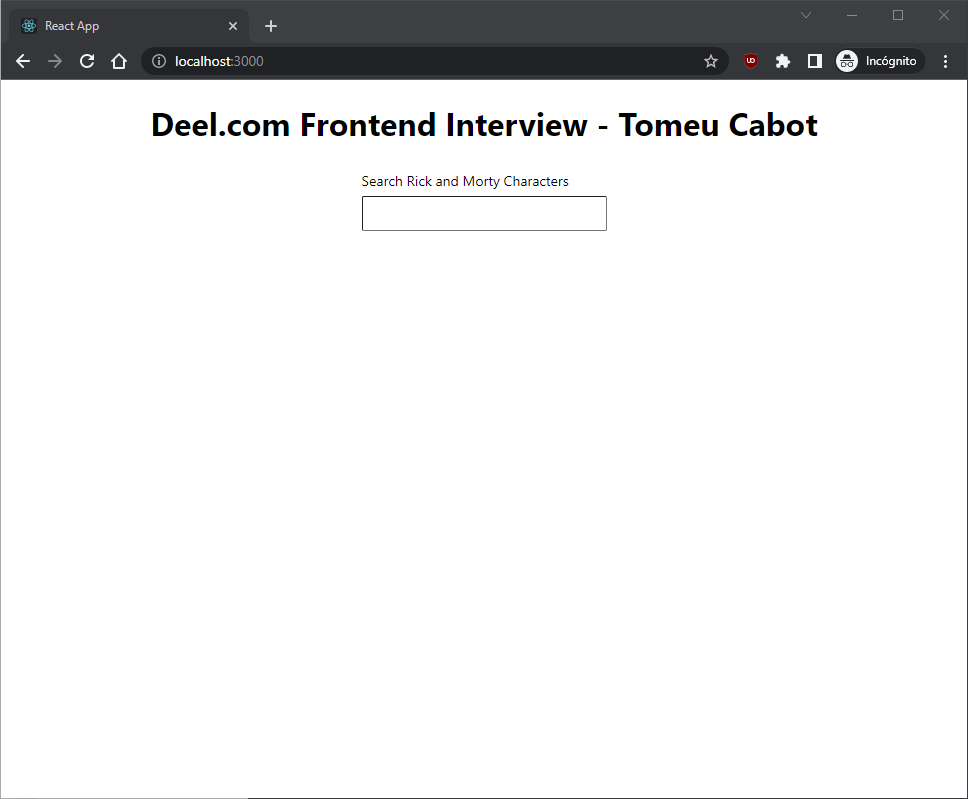
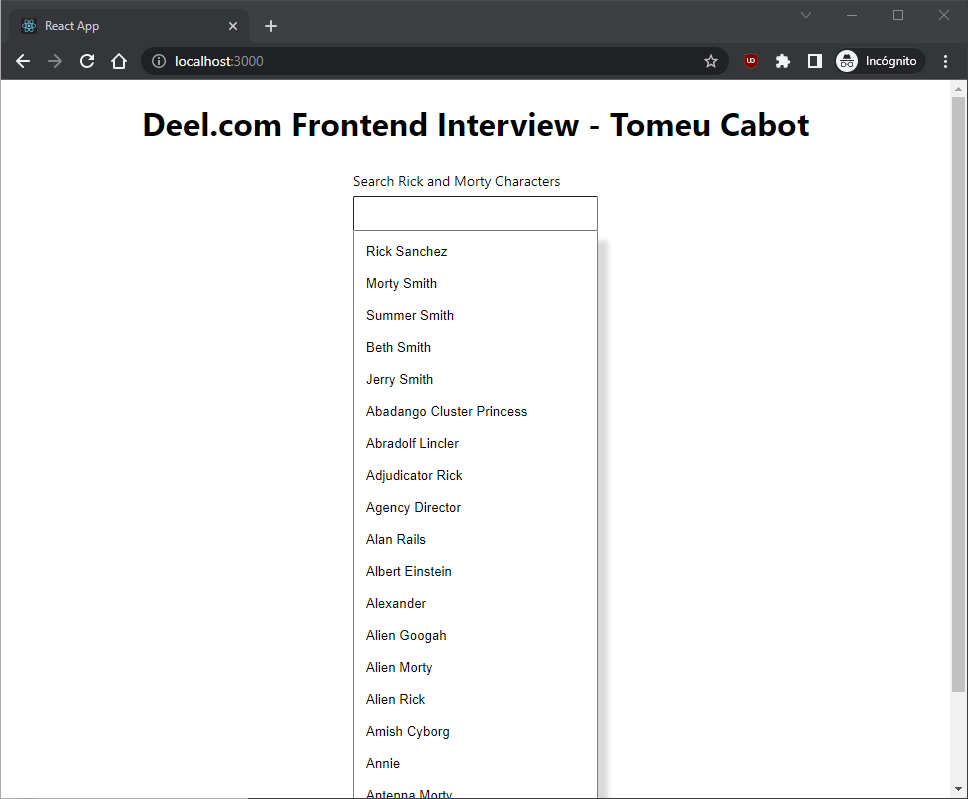
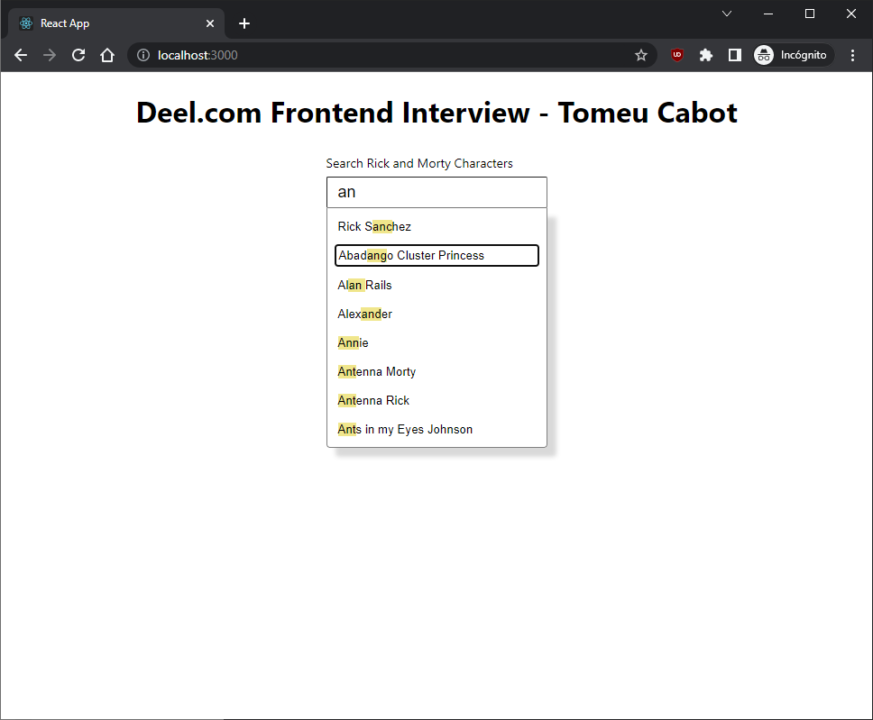

# deel.com - Frontend Interview

> URL preview: tbd

## Get Started

### 📚 Install dependencies

```bash
$ npm install
```

### 🚀 Lunch the site!

```bash
$ npm start
```

### ✏ Approach

This is what I have been able to achieve in 90min, I took very seriously the time spend on this challenge. I started with a more accessible approach with [datalist](https://developer.mozilla.org/en-US/docs/Web/HTML/Element/datalist) which is the default auto-complete with input and it handles keystrokes automatically for the browser but then I realized that is not good for customization. Sigh! After spending 30min on that I wanted to implement it myself but I didn't want to deal with key events so I tried to use the web as much as possible. Lists and buttons which are focusable and ready for screen-readers.

At that moment I realized that maybe what they want is for every keystroke a new petition to the API (cache results) and show the suggestions. That won't be too much difficult to implement, something like:

```tsx
<Searchbar
	onChangeSearch={(search) => fetchNewData(search)}
	options={options}
/>
```

Finally, I decided to implement an API with "Rick and Morty" API example and a hook to handle whenever user clicks outside.

### 📸 Screenshots






### 🧹 todos

1. (reliability) Testing 🧪
1. (a11y) Implement arrow selection on the dropdown, right now it only works with tabs, enter and space.
1. (a11y) Close `SuggestionList` when `ESC` is pressed.
1. (feature) Loading state when is loading the list
1. (design) Use CSS variables to keep margin/padding consistens and colors (DRY)
1. (design) Make the `SuggestionList` scrollable
1. (reliability) typing!
1. (feature) expose suggestion component to be personalized - maybe we want to show a picture close to the name.
1. (feature) hide the `SuggestionList` when there is no suggestion.
